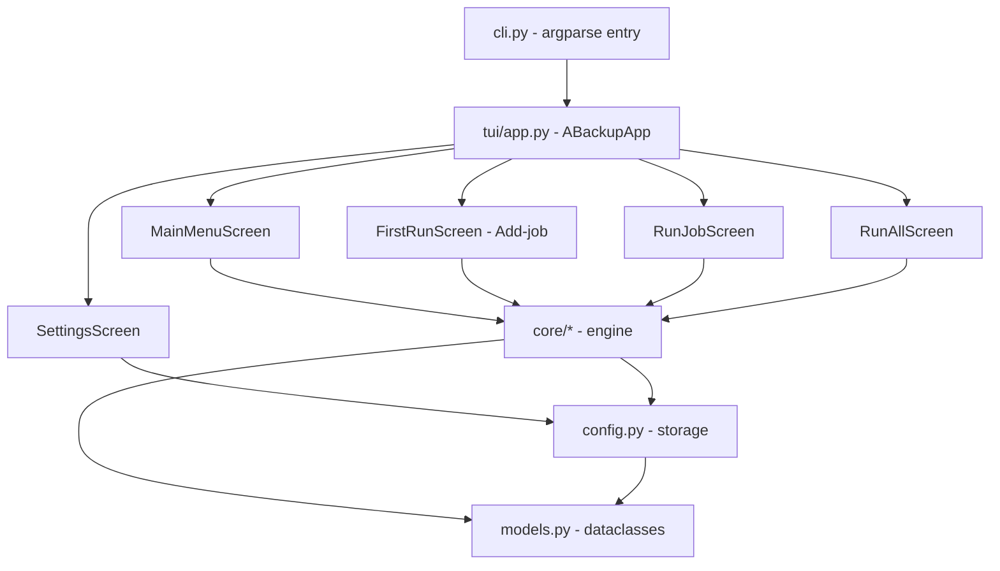

# Component Architecture — ABackup

**Date**: 2026-07-13
**Scope**: module/screen structure, communication patterns, testing strategy.

## 1. Layered Structure

- **Presentation layer** (`tui/`): Textual screens. Thin — no business logic, only load/persist + render.
- **Engine layer** (`core/`): framework-agnostic, fully unit-tested. Pure functions + dataclasses.
- **Storage layer** (`config.py` + `models.py`): atomic JSON persistence + typed models.
- **Infra** (`utils/`): typed errors, JSONL logging.

## 2. Screen Inventory (components)

| Screen | File | Role | Key widgets |
|--------|------|------|-------------|
| `ABackupApp` | [`app.py`](../../src/abackup/tui/app.py:14) | Root app, mounts `MainMenuScreen`, binds `q`=quit | — |
| `MainMenuScreen` | [`main_menu.py`](../../src/abackup/tui/screens/main_menu.py:16) | Job list + actions (Run/Run-all/Delete/Settings/Quit) | `ListView`, `Button`s |
| `FirstRunScreen` | [`first_run.py`](../../src/abackup/tui/screens/first_run.py:21) | **Add-job** wizard (source/dest/method) | `Input`, `RadioSet`, `Button` |
| `RunJobScreen` | [`run_job.py`](../../src/abackup/tui/screens/run_job.py:34) | Single-job run with live progress | `ProgressBar`, `Label`, `RichLog` |
| `RunAllScreen` | [`run_all.py`](../../src/abackup/tui/screens/run_all.py:88) | Concurrent batch + aggregate/per-job bars + Cancel | `ProgressBar`×N, `Button` |
| `SettingsScreen` | [`settings.py`](../../src/abackup/tui/screens/settings.py:141) | Global options + storage relocation | `Input`, `Select`, `Checkbox` |

> ⚠️ Naming debt: `FirstRunScreen` is the *Add-job* form; the app has no first-run gate (see IMP-001).

## 3. Engine Module Inventory

| Module | Responsibility |
|--------|----------------|
| [`core/backup.py`](../../src/abackup/core/backup.py:45) | `run_job` orchestrator → copy/zip/7z; writes manifest+log; returns updated job |
| [`core/runner.py`](../../src/abackup/core/runner.py:30) | `run_jobs_batch` — bounded worker pool + queue, cancel, lock-guarded persist |
| [`core/copy.py`](../../src/abackup/core/copy.py:68) | Atomic per-file copy, 1 MiB chunks, skip-if-identical |
| [`core/archive.py`](../../src/abackup/core/archive.py:27) | Deterministic zip (fixed epoch) |
| [`core/compression.py`](../../src/abackup/core/compression.py:146) | `make_archive` engine selection; `find_7z` (env/PATH/registry/hardcoded); `make_7z` (polls temp file for progress) |
| [`core/progress.py`](../../src/abackup/core/progress.py:30) | Frozen `Progress` dataclass (thread-safe snapshot) |
| [`core/jobs.py`](../../src/abackup/core/jobs.py) | Pure CRUD over `jobs.json` |
| [`core/paths.py`](../../src/abackup/core/paths.py:168) | `shorten_path`, `shorten_display_path`, `format_job_label` |

## 4. Communication Patterns

- **Screen → Engine**: screens call `core` functions directly (synchronous) inside a Textual **worker thread** (`run_worker` / `app.run_worker`) so the UI never blocks.
- **Engine → Screen (progress)**: callbacks receive a frozen `Progress` snapshot; the batch runner marshals them onto the event loop via `app.call_from_thread` ([`run_all.py`](../../src/abackup/tui/screens/run_all.py:86)) — never touches widgets from a worker thread.
- **Cancellation**: a shared `threading.Event` is passed into `run_jobs_batch`; engines check it between (and mid-) file chunks ([`runner.py`](../../src/abackup/core/runner.py:30), [`copy.py`](../../src/abackup/core/copy.py:19)).
- **Navigation**: `push_screen` / `pop_screen`; no global router (appropriate for 5 screens).

## 5. Testing Strategy

- **Unit** (`tests/`): every `core/` module has a dedicated `test_*.py` with `pytest` + `pytest-mock` + `freezegun` (deterministic time/IDs). Coverage gate `--cov-fail-under=90` ([`pyproject.toml`](../../pyproject.toml:34)).
- **TUI**: Textual `run_test()` pilot drives screens headlessly (`test_tui.py`).
- **Isolation**: temp dirs via `tmp_path`; `monkeypatch` for `platformdirs`, `find_7z`, `subprocess`.
- **Gaps** 🟡: `utils/logging.py` manifest/log rotation under-tested; no property tests for path elision beyond the unit set.
