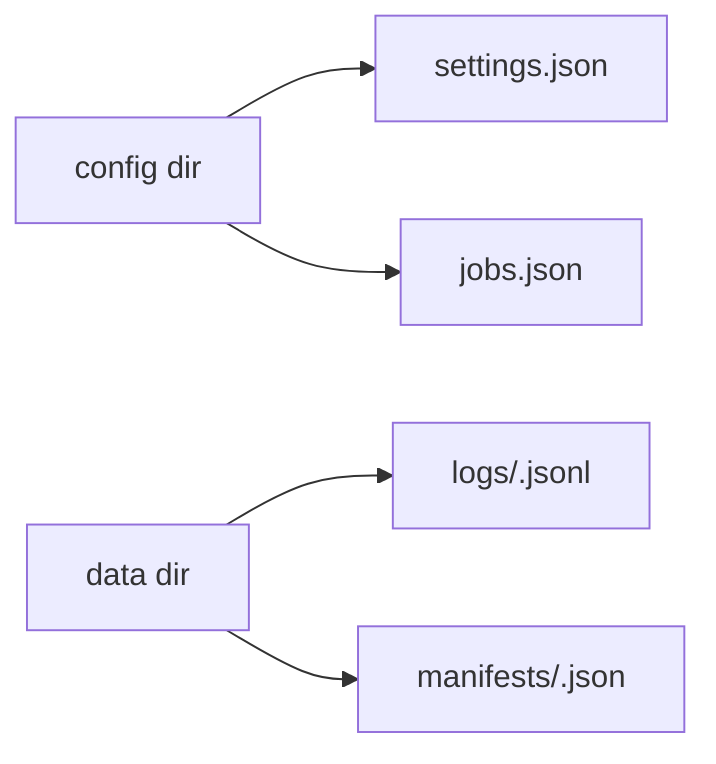
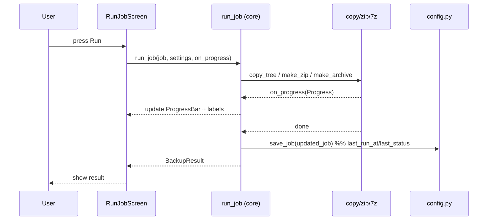
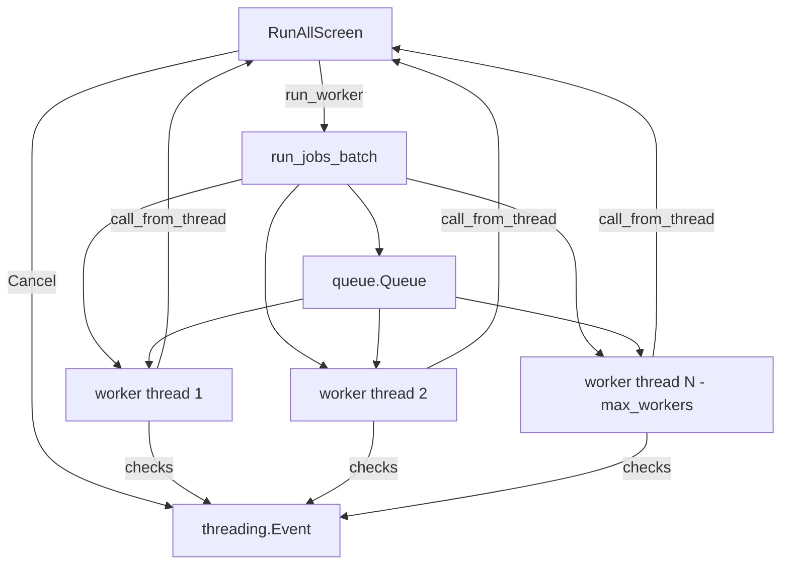
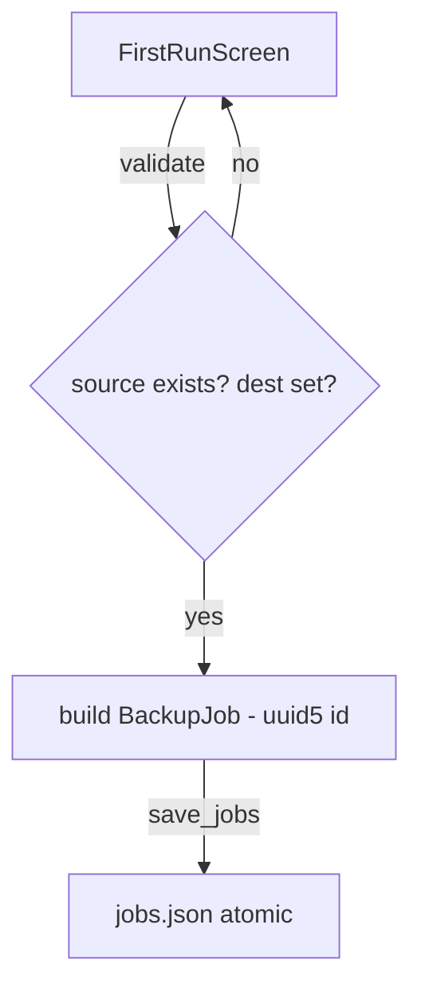

# Data Flow — ABackup

**Date**: 2026-07-13

## 1. Storage Layout



- Config dir: `platformdirs.user_config_dir("abackup")` (overridable via `--config-dir`).
- Data dir: `platformdirs.user_data_dir("abackup")` (overridable via `--data-dir`).
- All writes atomic: `tempfile.mkstemp` → write → `os.fsync` → `os.replace` ([`config.py`](../../src/abackup/config.py:26)).

## 2. Single-Job Run Flow



- `on_progress` receives a **frozen** `Progress` snapshot ([`progress.py`](../../src/abackup/core/progress.py:30)) — safe to read from the UI thread.
- For 7z, progress is estimated by polling the **growing temp archive file size** against an adaptive estimate (`est = max(bytes_total//2, cur)`) — avoids pipe-buffering stalls ([`compression.py`](../../src/abackup/core/compression.py:414)).

## 3. Batch (Run-All) Concurrency Flow



- `run_jobs_batch` ([`runner.py`](../../src/abackup/core/runner.py:30)) enqueues jobs, spins a bounded pool (`max_workers` from settings), each worker calls `run_job` and persists the updated job under a `threading.Lock`.
- Progress callbacks are marshalled to the Textual event loop via `app.call_from_thread` ([`run_all.py`](../../src/abackup/tui/screens/run_all.py:86)) — widgets are never touched from worker threads.
- **Cancel**: the screen sets a shared `threading.Event`; engines check it between (and mid-) file chunks, raising `JobCancelled` ([`copy.py`](../../src/abackup/core/copy.py:19), [`runner.py`](../../src/abackup/core/runner.py:30)).
- **Back disabled** until completion to avoid popping the screen while threads run ([`run_all.py`](../../src/abackup/tui/screens/run_all.py:88)).

## 4. Add-Job Flow



- Job ID is deterministic: `uuid5(NAMESPACE, f"{source}|{destination}|{method}|{created_at}")` ([`models.py`](../../src/abackup/models.py:90)).
- ⚠️ No `destination != source` or disk-space check yet (IMP-002).

## 5. Settings / Storage Relocation Flow

```mermaid
graph TD
    ST[SettingsScreen] -->|edit| S[Settings dataclass]
    ST -->|save_settings| Cfg[settings.json atomic]
    ST -->|relocate| R[relocate_storage]
    R -->|move| Cfg2[settings.json + jobs.json]
    R -.->|NOT moved: logs/manifests| D[data dir]  %% IMP-007
```

- `relocate_storage` ([`config.py`](../../src/abackup/config.py:81)) atomically moves only `settings.json` + `jobs.json`. Logs/manifests are **not** moved (IMP-007).
- Legacy migration: one-time move from old `platformdirs` path to home-based layout ([`config.py`](../../src/abackup/config.py:100)).
