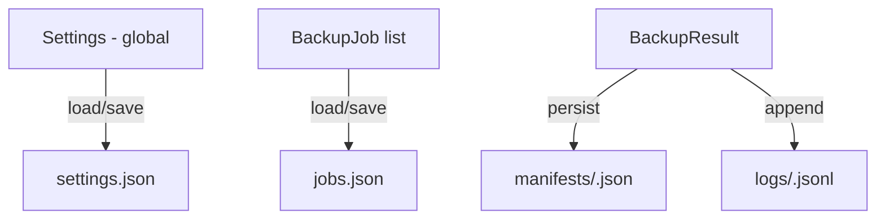
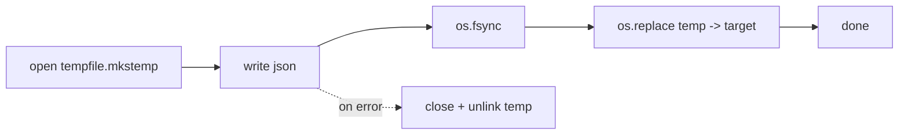

# State Management — ABackup

**Date**: 2026-07-13

## 1. Model

ABackup uses **file-backed JSON state** — there is no in-memory database or global store. State lives in two JSON files plus a data dir of logs/manifests. Each mutation re-reads the whole file, applies the change, and atomically rewrites it. At this scale (tens of jobs) the cost is negligible and the simplicity is a feature.

## 2. State Owners

| State | Type | File | Owner |
|-------|------|------|--------|
| Global settings | `Settings` dataclass | `settings.json` | `config.load_settings` / `save_settings` |
| Job list | `list[BackupJob]` | `jobs.json` | `core/jobs.py` (CRUD) |
| Per-run result | `BackupResult` | `manifests/<id>.json` + `logs/<id>.jsonl` | `core/backup.py` |
| Ephemeral UI | `Progress`, `threading.Event` | (memory only) | screens / `run_jobs_batch` |

## 3. Typed Models ([`models.py`](../../src/abackup/models.py))

- **`Settings`** ([`models.py`](../../src/abackup/models.py:36)): `storage_dir`, `default_destination`, `max_workers`, `seven_zip_compression_level`, `zip_compression_level`, `log_level`, `prefer_py7zr`. Has `validate()` ([`models.py`](../../src/abackup/models.py:59)) enforcing ranges (e.g., `1 <= max_workers <= 32`, `0 <= levels <= 9`).
- **`BackupJob`** ([`models.py`](../../src/abackup/models.py:72)): `id` (uuid5), `name`, `source`, `destination`, `method` (`BackupMethod` enum: `COPY`/`ZIP`/`SEVEN_ZIP`), `created_at`, `last_run_at`, `last_status`. `id` is deterministic from content + `created_at` ([`models.py`](../../src/abackup/models.py:90)) — re-creating the same job yields the same id (idempotent).
- **`BackupMethod`** enum drives engine selection in `run_job` ([`backup.py`](../../src/abackup/core/backup.py:45)).

## 4. Atomic Write Contract

All persistence goes through `_atomic_write` ([`config.py`](../../src/abackup/config.py:26)):

- `os.replace` is atomic on both Windows and POSIX — readers never see a partial file.
- Per-file copies/archives use the same temp+rename pattern ([`copy.py`](../../src/abackup/core/copy.py:33), [`archive.py`](../../src/abackup/core/archive.py:62)).
- `except` blocks clean up the temp file so a crash never leaves junk.

## 5. Concurrency & Locking

- **Batch runner** ([`runner.py`](../../src/abackup/core/runner.py:30)): a `threading.Lock` guards `save_job` calls so concurrent workers don't clobber `jobs.json`.
- **Progress**: the `Progress` dataclass is **frozen** ([`progress.py`](../../src/abackup/core/progress.py:30)) — workers build a new snapshot each tick; the UI reads an immutable copy. No shared mutable progress state.
- **Cancellation**: a single `threading.Event` is shared across all workers; checked between/within file chunks. No locks needed for the flag (Events are thread-safe).

## 6. Determinism

- Job IDs: `uuid5` over a fixed namespace + content ([`models.py`](../../src/abackup/models.py:90)).
- Zip output: fixed `ZIP_EPOCH` so identical trees produce byte-identical zips ([`archive.py`](../../src/abackup/core/archive.py:20)).
- Clocks are injectable (`freezegun` in tests) so `created_at`/`last_run_at` are reproducible.

## 7. Known State Gaps

- **IMP-007**: `relocate_storage` moves only `settings.json`+`jobs.json`; `logs/`+`manifests/` are orphaned.
- **IMP-003**: `RunJobScreen._run` calls `load_settings` twice ([`run_job.py`](../../src/abackup/tui/screens/run_job.py:53)) — minor; could drift if settings change mid-run (they can't, but it's redundant).
- **No schema versioning**: `Settings`/`BackupJob` have no `version` field; a future field addition would silently use defaults on old files. Consider a `schema_version` for forward-compat.
