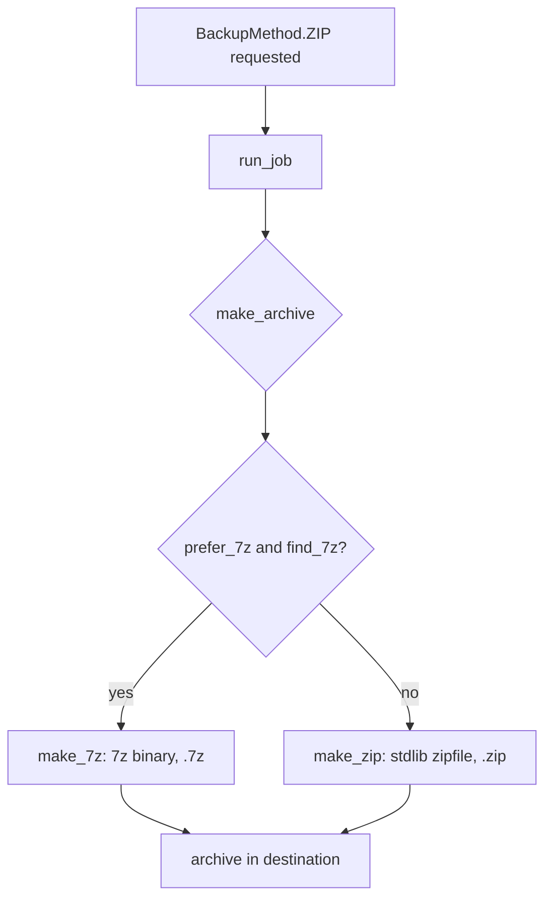

# Plan: Use 7-Zip by default when available (stdlib zipfile fallback)

## Feasibility
Yes. The "Zip archive" method currently calls `make_zip` (stdlib `zipfile`) from
`backup.py`. We can keep that as a **fallback** and, when a 7-Zip binary is
detected on the system, use it instead for better compression (LZMA2) and speed
(7z is multithreaded). No behaviour breaks: the method still produces a single
archive in the destination; only the engine and file extension change.

## Recommended approach: detect the 7z binary, prefer it, fall back to stdlib
- **Why a binary over a library?** Detecting the installed `7z`/`7za` avoids a
  new dependency, reuses the user's already-installed, optimized, multithreaded
  compressor, and works cross-platform (PATH + common install locations).
- **Alternative (library):** `py7zr` is a pure-Python 7z implementation. It would
  add a dependency and is generally slower than the native binary. We note it as
  an option but do **not** adopt it now.
- **Default behaviour:** prefer 7z when found; otherwise use stdlib `zipfile`.
  A `prefer_7z` setting (default `True`) lets users force the deterministic
  stdlib path if they need byte-reproducible output.

## Tradeoffs (documented, accepted)
- **Determinism:** the stdlib `.zip` path is byte-for-byte reproducible (fixed
  `ZIP_EPOCH`, sorted entries). 7z archives include header metadata/timestamps,
  so they are **not** byte-reproducible. We keep the `.zip` path for users who
  need that property (set `prefer_7z = False`).
- **Realtime progress:** the stdlib path emits smooth per-chunk byte progress.
  For 7z we pre-scan totals and emit a start snapshot plus a completion snapshot
  (the binary does not easily expose per-chunk bytes). The bar still moves
  (0% -> 100%); per-file percentage parsing from `-bsp1` output is a possible
  later refinement, not required now.

## Steps

### Step 1 — New `core/compression.py`
- `find_7z() -> str | None`: check `shutil.which("7z")`, then `7za`, `7zr`, then
  common paths:
  - Windows: `C:\Program Files\7-Zip\7z.exe`, `C:\Program Files (x86)\7-Zip\7z.exe`
  - macOS: `/opt/homebrew/bin/7z`, `/usr/local/bin/7z`
  - Linux: `/usr/bin/7z`, `/usr/local/bin/7z`
- `make_archive(source, destination, *, when=None, compress_level=6, cancel=None,
  job_id="", on_progress=None, prefer_7z=True) -> Path`:
  - If `prefer_7z` and `find_7z()` returns a binary -> `make_7z(...)` (see Step 2).
  - Else -> existing `make_zip(...)` (deterministic `.zip`).

### Step 2 — `make_7z` (in `core/compression.py`)
- Pre-scan files (sorted) for `files_total` / `bytes_total`; emit a start
  `Progress` (phase `PHASE_ZIPPING`).
- Build the archive with `subprocess.Popen`:
  `7z a -y -t7z -mx{level} -bsp1 <archive.7z> .` run with `cwd=source` so archive
  contents are the source's files (no top-level folder), matching `make_zip`.
- **Cancel:** poll `cancel` (a `threading.Event`); if set, `proc.terminate()`
  then `proc.kill()` and raise `JobCancelled`.
- On success: atomic `os.replace(tmp, final)`; emit a 100% `Progress`.
- Extension is `.7z`; name from `safe_archive_name(..., ext=".7z")`.

### Step 3 — `paths.py`: `safe_archive_name` gains `ext=".zip"`
- Add `ext` parameter so both `.zip` and `.7z` names are produced consistently.

### Step 4 — `backup.py`: dispatch to `make_archive`
- Replace `make_zip(...)` call with `make_archive(..., prefer_7z=prefer_7z)`.
- Add `prefer_7z: bool = True` parameter to `run_job`; thread it from settings.

### Step 5 — `models.py`: `Settings.prefer_7z: bool = True`
- Add field; no new validation needed (boolean).

### Step 6 — Settings screen (optional toggle)
- Add a "Prefer 7-Zip (if installed)" checkbox in `tui/screens/settings.py`;
  persist via existing `Settings(...)` construction.

### Step 7 — Runner / CLI threading
- `core/runner.run_jobs_batch` and `cli --run-all` already read settings; pass
  `prefer_7z=settings.prefer_7z` into `run_job`.

### Step 8 — Tests (`tests/test_compression.py`, update others)
- `find_7z`: returns binary when `shutil.which`/common path exists (mock both);
  returns `None` when absent.
- `make_archive`: with `find_7z` mocked to a fake binary + `subprocess.run`
  mocked to write a dummy `.7z`, asserts a `.7z` is produced and correct args;
  with `prefer_7z=False` (or no binary) asserts a `.zip` is produced via
  `make_zip` (reuse existing `make_zip` tests).
- `make_7z` cancel: `subprocess.Popen` mock + `cancel.set()` -> `JobCancelled`.
- `test_backup.py`: cover both `prefer_7z` True/False dispatch.

### Step 9 — README
- Document 7-Zip auto-detection, the `.7z` vs `.zip` choice, and the
  determinism tradeoff (set `prefer_7z = False` for reproducible zips).

### Step 10 — Run suite + coverage gate (>=90%), then commit.

## Dispatch flow

## Files touched
- `src/abackup/core/compression.py` (new: `find_7z`, `make_archive`, `make_7z`)
- `src/abackup/core/archive.py` (keep `make_zip`; minor import tweak)
- `src/abackup/core/paths.py` (`safe_archive_name` `ext` param)
- `src/abackup/core/backup.py` (dispatch to `make_archive`, `prefer_7z` param)
- `src/abackup/models.py` (`Settings.prefer_7z`)
- `src/abackup/tui/screens/settings.py` (optional toggle)
- `src/abackup/core/runner.py` + `src/abackup/cli.py` (thread `prefer_7z`)
- `tests/test_compression.py` (new) + updates to `test_backup.py`/`test_archive.py`
- `README.md`
