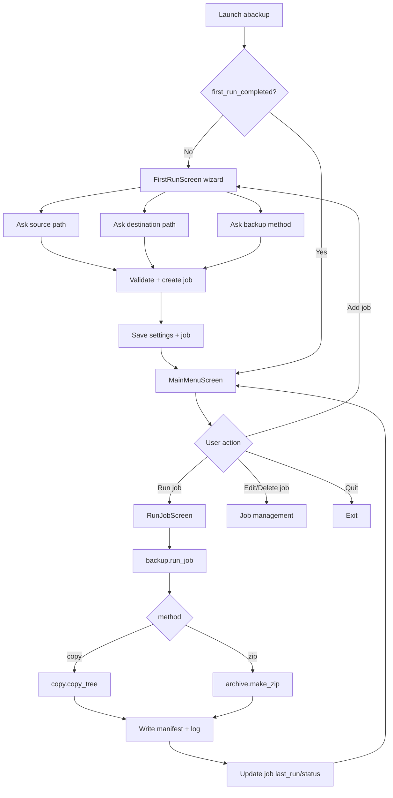

# ABackup — Full-Featured CLI Backup App with TUI

**Plan date:** 2026-07-12
**Status:** Draft for review
**Mode:** Architect (plan only — no implementation in this document)

---

## 1. Goals & Scope

Build a Python CLI application with a **proper full-screen Terminal User Interface (TUI)** that backs up local files.

Required behavior:
- On **first run**, the app interactively asks the user for:
  1. **Source (backup) folder path**
  2. **Destination folder path**
  3. **Backup method**
- Two backup methods:
  - **Direct copy** — recursively copy the source folder tree into the destination.
  - **Zip archive** — create `<source_folder_name>_<YYYY-MM-DD>.zip` in the destination.
- Persist **jobs** and **settings** in a robust, inspectable store.
- Every step is **deterministic** (no hidden time/randomness in logic paths) and **atomic** (each unit does one thing, fully reversible on failure where possible), and **covered by tests**.

Out of scope (noted for later phases): scheduling/daemon mode, cloud destinations, encryption, incremental/dedupe backups, network sources.

---

## 2. Key Architecture Decisions (with rationale)

| Decision | Choice | Rationale | Fallback |
|---|---|---|---|
| Language | Python 3.11+ | `pathlib`, `dataclasses`, `tomllib`, `zipfile`, type hints | 3.9+ (drop `tomllib`) |
| TUI framework | **Textual** | Leading Python full-screen TUI; widgets, screens, async, testable via `textual.pilot` | `curses` (stdlib) if zero third-party deps mandated |
| Display | Rich (bundled with Textual) | Tables, progress bars, panels | stdlib `textwrap` |
| Config dir resolution | `platformdirs` | Correct per-OS config/data paths (cross-platform) | manual `os`-based resolution |
| Settings/job storage | **JSON files** (one settings file, one jobs file) | Human-readable, diffable, stdlib `json`, atomic write via temp+rename | SQLite if relational queries needed later |
| Testing | `pytest` + `pytest-mock` + `freezegun` | Standard, deterministic time control | `unittest` |
| Packaging | `pyproject.toml` (PEP 621), `src` layout, console script `abackup` | Modern, `pip install -e .` | — |

**Why JSON over YAML/TOML/SQLite:** jobs are a small, append/update list with a stable schema; JSON is dependency-free (stdlib), trivially atomic (write temp file then `os.replace`), and easy to validate. TOML is config-oriented (single doc, less ideal for a growing job list); SQLite adds a dependency and complexity not justified at this scale.

**Storage layout (per `platformdirs`):**
```
<config_dir>/abackup/
    settings.json      # global settings + first_run flag
    jobs.json          # array of job records
<data_dir>/abackup/
    logs/              # run logs (one per backup run)
    manifests/         # optional per-run file manifest
```

---

## 3. Project Structure

```
abackup/
├── pyproject.toml
├── README.md
├── docs/
│   └── plans/
│       └── 2026-07-12-abackup-cli-plan.md   # this file
├── src/
│   └── abackup/
│       ├── __init__.py
│       ├── __main__.py            # python -m abackup
│       ├── cli.py                 # console_scripts entry; builds App
│       ├── config.py              # load/save settings + jobs (atomic)
│       ├── models.py              # BackupJob, Settings dataclasses + schema
│       ├── core/
│       │   ├── __init__.py
│       │   ├── paths.py           # config/data dir resolution, safe names
│       │   ├── discovery.py       # first-run detection
│       │   ├── copy.py            # direct-copy method (atomic, resumable)
│       │   ├── archive.py         # zip method (deterministic naming)
│       │   ├── backup.py          # orchestrator: validate -> run -> report
│       │   └── jobs.py            # job CRUD + listing
│       ├── tui/
│       │   ├── __init__.py
│       │   ├── app.py             # ABackupApp (Textual)
│       │   ├── screens/
│       │   │   ├── first_run.py   # FirstRunScreen wizard
│       │   │   ├── main_menu.py   # MainMenuScreen
│       │   │   └── run_job.py     # RunJobScreen (progress)
│       │   └── widgets/
│       │       ├── path_input.py  # validated path field + picker
│       │       └── method_select.py
│       └── utils/
│           ├── logging.py         # structured run logger
│           └── errors.py          # typed exceptions
└── tests/
    ├── conftest.py                # fixtures: tmp config dir, sample tree, frozen time
    ├── test_models.py
    ├── test_paths.py
    ├── test_config.py
    ├── test_discovery.py
    ├── test_copy.py
    ├── test_archive.py
    ├── test_backup.py
    ├── test_jobs.py
    └── test_tui.py                # textual.pilot screen tests
```

---

## 4. Data Model & Storage Schema

### `Settings` (settings.json)
```json
{
  "schema_version": 1,
  "first_run_completed": false,
  "default_destination": null,
  "log_level": "INFO",
  "created_at": "2026-07-12T11:09:13+03:00"
}
```

### `BackupJob` (jobs.json — array)
```json
{
  "id": "a1b2c3d4",
  "name": "Documents",
  "source": "C:/Users/art/Documents",
  "destination": "D:/Backups",
  "method": "zip",
  "created_at": "2026-07-12T11:10:00+03:00",
  "last_run_at": null,
  "last_status": null
}
```

- `method` is an enum: `"copy"` | `"zip"`.
- `id` generated deterministically from a hash of `(source, destination, method, created_at)` so tests are reproducible (no `uuid4` in logic; use `uuid5` with a fixed namespace).

---

## 5. Workflow (Mermaid)



---

## 6. Detailed Atomic Steps (each with tests)

> **Determinism rules applied throughout:**
> - All timestamps injected via a `clock` parameter (default `datetime.now`) so tests freeze time with `freezegun`.
> - All IDs via `uuid5` (deterministic) not `uuid4`.
> - File operations are atomic: write to `<name>.tmp` then `os.replace`.
> - No network, no global mutable state; config dir is injectable for tests.

### Step 1 — Project scaffolding & packaging
- Create `pyproject.toml` (PEP 621) with `src` layout, dependency `textual`, `platformdirs`; dev deps `pytest`, `pytest-mock`, `freezegun`.
- Add `console_scripts` entry `abackup = abackup.cli:main`.
- Create package skeleton (`__init__.py`, `__main__.py`).
- **Tests:** `test` that `python -m abackup` imports without error (smoke); `pyproject.toml` parses; `import abackup` succeeds.

### Step 2 — Path & directory resolution (`core/paths.py`)
- `get_config_dir()` / `get_data_dir()` via `platformdirs` (injectable override for tests).
- `ensure_dir(path)` (idempotent, atomic mkdir).
- `safe_archive_name(source_name, date)` -> `"<source_name>_<YYYY-MM-DD>.zip"` (strip unsafe chars).
- `job_file_path()`, `settings_file_path()`.
- **Tests:** config dir override works; `safe_archive_name` strips spaces/`/` and formats date; `ensure_dir` is idempotent; collisions produce deterministic names.

### Step 3 — Data models (`models.py`)
- `BackupMethod` enum, `Settings` dataclass, `BackupJob` dataclass with `make_id()` using `uuid5`.
- `to_dict()` / `from_dict()` with schema validation; `Settings.is_first_run`.
- **Tests:** round-trip serialize/deserialize; invalid `method` raises; `make_id` deterministic for same inputs; unknown keys ignored with warning.

### Step 4 — Atomic config I/O (`config.py`)
- `load_settings()`, `save_settings()` (temp+`os.replace`).
- `load_jobs()`, `save_jobs()` (atomic, list of `BackupJob`).
- `init_storage(config_dir)` creates dirs + default settings if missing.
- **Tests:** save then load returns equal data; concurrent-safe atomic write (simulate by reading tmp absence); corrupt JSON -> raises typed `ConfigError` and keeps previous file; missing file -> defaults.

### Step 5 — First-run detection (`core/discovery.py`)
- `is_first_run(settings)` -> `not settings.first_run_completed`.
- `mark_first_run_done(settings)` returns updated settings (pure).
- **Tests:** true when flag false; false after mark; idempotent.

### Step 6 — Direct-copy method (`core/copy.py`)
- `copy_tree(source, destination, *, on_progress=None, clock=...)`:
  - Validate source exists & is dir.
  - Mirror tree into `destination/<source_name>/`.
  - Per-file copy with overwrite policy (default skip-if-identical by size+mtime).
  - Atomic per file: copy to `.tmp` then `os.replace`.
  - Emit progress callbacks (file count, bytes).
- **Tests (deterministic, tmp_path):** copies nested tree preserving structure; skips identical files; overwrites changed files; reports progress counts; fails cleanly if source missing (raises `SourceNotFound`); partial failure leaves no half-written final file (tmp cleaned).

### Step 7 — Zip method (`core/archive.py`)
- `make_zip(source, destination, *, clock=...)`:
  - Name via `safe_archive_name`.
  - Stream files into zip (no compression side-effects on source).
  - Deterministic: fixed `date_time` in zip entries (e.g., `(1980,1,1,0,0,0)`) so output bytes are reproducible for tests.
  - Atomic: build to `.tmp.zip` then `os.replace`.
- **Tests:** produces zip with expected name; contains all source files with deterministic entry order & timestamps; empty dirs handled; source unchanged; atomic rename; reproducible hash of zip across runs (freeze time).

### Step 8 — Backup orchestrator (`core/backup.py`)
- `run_job(job, *, config_dir=None, clock=..., on_progress=None)`:
  1. Load settings/jobs.
  2. Validate source/destination.
  3. Dispatch to copy or zip.
  4. Write run manifest + log.
  5. Update `job.last_run_at`, `job.last_status` (pure return of updated job; caller persists).
- Returns `BackupResult(summary, manifest_path, status)`.
- **Tests:** end-to-end copy job on fixture tree; end-to-end zip job; invalid source -> `SourceNotFound`; invalid destination (no write perms) -> `DestinationError`; status updated correctly; manifest content correct; idempotent given frozen clock.

### Step 9 — Job management (`core/jobs.py`)
- `add_job(jobs, job)` (dedupe by id), `get_job(jobs, id)`, `update_job`, `remove_job`, `list_jobs`.
- All pure (return new list) for testability; persistence handled by `config.save_jobs`.
- **Tests:** add/remove/update pure operations; dedupe; list ordering stable; missing id -> `JobNotFound`.

### Step 10 — TUI: First-run wizard (`tui/screens/first_run.py`)
- `FirstRunScreen`: validated source input (exists check), destination input (writable check), method radio (copy/zip).
- On submit: build `BackupJob`, call `config` save + `mark_first_run_done`, then switch to `MainMenuScreen`.
- **Tests (textual.pilot):** wizard appears on first run; invalid source shows error and blocks submit; selecting zip sets method; submit persists settings + job (assert files on disk in tmp config dir).

### Step 11 — TUI: Main menu & job management (`tui/screens/main_menu.py`)
- Lists jobs (Rich table), actions: Run, Add, Edit, Delete, Quit.
- Edit/Delete delegate to `core/jobs` + `config`.
- **Tests:** table renders jobs; Add navigates to FirstRunScreen; Delete removes from store; Quit exits app; empty-state message when no jobs.

### Step 12 — TUI: Run job with progress (`tui/screens/run_job.py`)
- `RunJobScreen(job)`: calls `backup.run_job` with `on_progress` updating a Rich progress bar; shows summary + manifest path; returns to menu.
- **Tests:** progress widget updates per callback; success screen shows counts; failure screen shows error; job `last_run_at` updated after run.

### Step 13 — Logging & errors (`utils/logging.py`, `utils/errors.py`)
- `RunLogger` writes structured JSON lines to `logs/<job_id>_<date>.jsonl` (atomic append).
- Typed exceptions: `ABackupError`, `ConfigError`, `SourceNotFound`, `DestinationError`, `JobNotFound`.
- **Tests:** log file created with expected entries; exception hierarchy correct; log write atomic.

### Step 14 — CLI entry & packaging polish (`cli.py`, `__main__.py`)
- `main()`: resolve config dir, `init_storage`, launch `ABackupApp`. Handle `--version`, `--config-dir` (override for tests/portable use), `--reset` (clear first-run for re-wizard).
- **Tests:** `--version` prints version & exits 0; `--config-dir` overrides storage; `--reset` flips first-run flag; normal launch boots TUI (smoke with pilot).

### Step 15 — Documentation (`README.md`)
- Install, usage, first-run flow, methods, storage locations, config override, dev/test instructions.
- **Tests:** README mentions all commands; `pyproject` metadata matches README.

---

## 7. Testing Strategy

- **Unit:** every `core/*` module pure & isolated; freeze time; `tmp_path` for filesystem.
- **Integration:** `backup.run_job` against fixture trees (copy + zip).
- **TUI:** `textual.pilot` to drive screens headlessly and assert persisted state.
- **Atomicity:** assert no `.tmp` leftovers after success/failure; `os.replace` guarantees atomic swap.
- **Determinism:** zip hash stable across runs; IDs stable; no `uuid4`/`random` in logic.
- **Coverage gate:** `pytest --cov=src/abackup --cov-fail-under=90` in CI.

---

## 8. Acceptance Criteria

1. Fresh launch with no config triggers the first-run wizard asking source, destination, method.
2. After wizard, settings + at least one job persist and survive restart.
3. `copy` method reproduces the source tree in destination; `zip` method creates `<name>_<YYYY-MM-DD>.zip`.
4. All 15 steps have corresponding passing tests; coverage >= 90%.
5. App launches as `abackup` (console script) and `python -m abackup`.
6. `--config-dir` and `--reset` work for portable/automated use.

---

## 9. Open Decisions (documented, not blocking)

- **TUI framework = Textual** chosen for a "proper" full-screen UI. If a strict zero-dependency mandate appears later, fall back to `curses` (Step 10–12 rewritten; core unchanged).
- **Storage = JSON** chosen over SQLite/TOML for the stated scale; schema versioned for forward migration.
- **IDs = uuid5** (deterministic) instead of uuid4 to keep tests reproducible.
