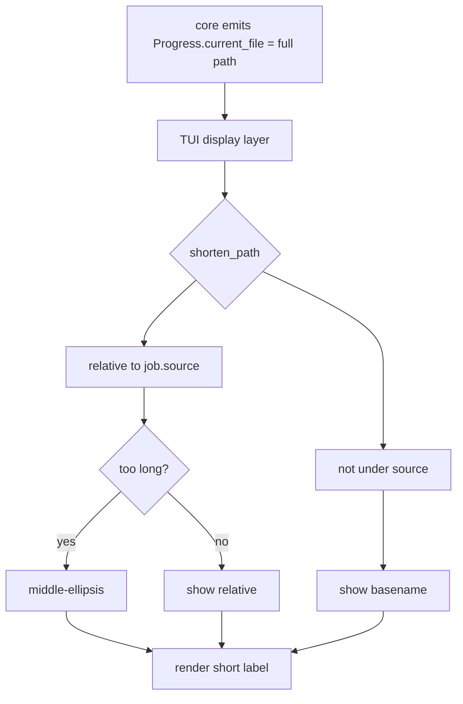

# Plan: Less-distracting progress display (shorten long file paths)

## Problem
The realtime progress UI prints the **full absolute path** of the file being
processed in two places:

- `run_job.py` -> `Current: {p.current_file}`
- `run_all.py` -> `{name}: {percent}% — {label}` where `label = prog.current_file`

Long paths (e.g. `C:\Users\user\Documents\projects\abackup\src\abackup\core\copy.py`)
wrap or push other content around, which is visually noisy during a backup.

The `current_file` full path is still useful for logs/manifests, so we keep it in
the core `Progress` payload and only **transform it at the display layer**.

## Chosen approach: relative-to-source + middle-ellipsis fallback
1. Compute a **display path** relative to the job's source directory (the folder
   being backed up). This is short and meaningful: `subdir/file.txt`.
2. If the relative path is still longer than a max width, **elide the middle**
   (keep the leading segment + `…` + basename), e.g. `src\back…\copy.py`.
3. If the file is not under the source root (edge case), fall back to the
   **basename**.
4. The full path remains available in the run-all `RichLog` (job-done lines) for
   users who want detail, so no information is lost.

## Steps

### Step 1 — Add `shorten_path` helper in `core/paths.py`
- `shorten_path(path: str, root: str | None = None, max_len: int = 40) -> str`
  - Normalize separators; if `root` given and `path` starts with `root`
    (case-insensitive on Windows), strip the prefix -> relative path.
  - If result length > `max_len`, elide the middle: keep first dir segment +
    `…` + basename, total <= `max_len`.
  - If not under `root`, fall back to basename (then elide if needed).
  - Empty/None path -> `""`.
- Pure, deterministic, no I/O -> easy to unit test.

### Step 2 — Use it in `run_job.py`
- In `on_progress`, replace `f"Current: {p.current_file}"` with
  `f"Current: {shorten_path(p.current_file, self.job.source)}"`.
- Keep the final `result.summary` unchanged (shown once at the end, not live).

### Step 3 — Use it in `run_all.py`
- Store per-job source root alongside names:
  `self._job_sources = {j.id: j.source for j in jobs}`.
- In `_update_job`, compute
  `label = shorten_path(prog.current_file, self._job_sources.get(jid)) or prog.phase`.
- Per-job line becomes e.g. `Documents: 42% — subdir/file.txt`.

### Step 4 — Unit tests for `shorten_path` (in `tests/test_paths.py`)
- relative reduction: path under root -> relative.
- elision: relative still > max_len -> middle `…` preserved basename.
- not-under-root -> basename.
- empty path -> `""`.
- Windows case-insensitive root match.

### Step 5 — TUI tests still valid
- `test_run_job_screen_shows_realtime_progress` asserts `"mid.txt"` in the
  current label -> basename preserved, still passes.
- `test_run_all_screen_shows_realtime_progress` asserts job names + `"100%"` ->
  unaffected.

### Step 6 — README note (small)
- Mention progress shows the path relative to the backup source.

### Step 7 — Run suite + coverage gate
- `pytest --cov=src/abackup --cov-fail-under=90`.

### Step 8 — Commit

## Display flow

## Files touched
- `src/abackup/core/paths.py` (new helper)
- `src/abackup/tui/screens/run_job.py` (use helper)
- `src/abackup/tui/screens/run_all.py` (use helper + per-job source)
- `tests/test_paths.py` (helper unit tests)
- `README.md` (small note)
