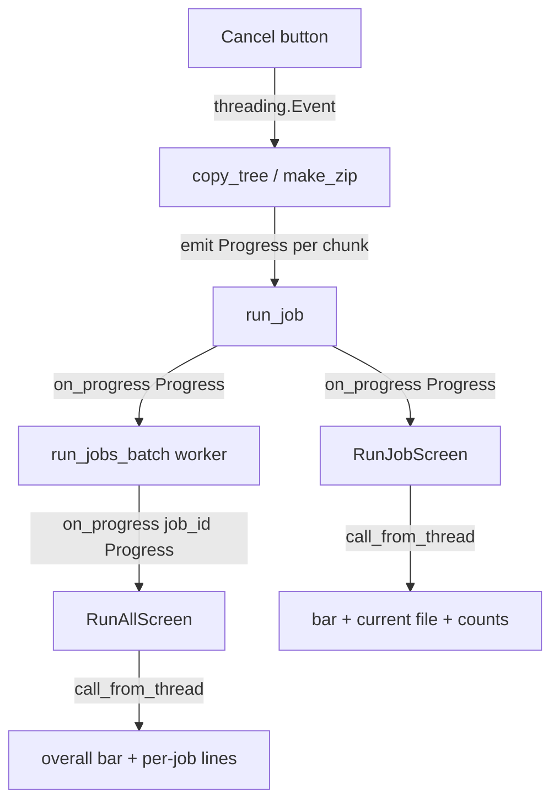

# ABackup — Realtime Job Progress

**Plan date:** 2026-07-12
**Status:** Draft for review
**Builds on:** [`2026-07-12-abackup-cli-plan.md`](2026-07-12-abackup-cli-plan.md), [`2026-07-12-abackup-run-all-batch-plan.md`](2026-07-12-abackup-run-all-batch-plan.md)
**Mode:** Architect (plan only — no implementation in this document)

---

## 1. Goals

Give the user **realtime visibility** into backup operations (copy and zip) at a
granularity finer than "job started / job finished":

1. **Byte-level progress** for both methods (not just per-file counts), so a single
   large file shows smooth movement.
2. **Current-file + counts** display (`file 3/12`, `45 MB / 120 MB`, `current: docs/a.txt`).
3. **Per-job realtime** progress in the Run-all screen, plus an **aggregate** overall
   progress bar across all concurrent jobs.
4. Keep all prior guarantees: **deterministic** (injectable scan/clock, no hidden
   globals), **atomic** (no corruption of `jobs.json` or partial archives), and
   **cancel-safe** (progress emission never blocks or delays cancellation checks).

---

## 2. Current State (gap analysis)

| Layer | Today | Gap |
|---|---|---|
| `core/copy.py` | `on_progress(done, total, path)` called **once per file** (file counts only) | No byte progress; large files show 0% then jump |
| `core/archive.py` | **No** `on_progress` at all | Zip shows nothing until 100% |
| `core/backup.py` | passes `on_progress` only to `copy_tree`; zip path ignores it | Zip progress missing |
| `core/runner.py` | `on_job_done(job_id, result)` (per-job completion only) | No in-flight per-job progress |
| `tui/run_job.py` | ProgressBar updated per file via `on_progress` | Jumps per file; blank for zip |
| `tui/run_all.py` | ProgressBar bumped **per finished job** | No realtime per-file/byte view |

---

## 3. Architecture Decisions

| Decision | Choice | Rationale | Fallback |
|---|---|---|---|
| Progress carrier | New `Progress` dataclass (immutable) passed to a single `ProgressCallback` | One structured object is easier to test/aggregate than a 3-tuple; avoids signature churn | keep `(done,total,path)` tuple |
| Totals source | **Pre-scan** source tree (walk + `stat` sizes) before copying/zipping | Accurate `bytes_total`/`files_total` up front; also enables ETA later | count during run (unknown total) |
| Copy granularity | Emit per **1 MiB chunk** (`bytes_done += len(chunk)`) | Smooth bar for big files; reuses existing chunk loop | per-file only |
| Zip granularity | Stream each file via `zf.open(info, "w")` writing **chunks** (replaces `writestr(full_bytes)`) | Enables per-chunk byte progress without loading whole file in RAM | keep `writestr` (no progress) |
| Determinism | Pre-scan + sorted iteration already used; chunk size is a constant | Archive bytes stay reproducible; progress is a pure function of files | — |
| Thread safety | Core emits callbacks from worker threads; TUI forwards via `app.call_from_thread` | Same pattern as existing `on_job_done` | queue + timer poll |
| Cancellation | `cancel` checked **before** each file and **between chunks**; progress callback is fire-and-forget (never awaited) | Progress never delays abort | — |
| Run-all aggregation | `on_progress(job_id, progress)` from batch; TUI sums `bytes_done`/`bytes_total` across live jobs | One overall bar + per-job lines | per-job bars only |

---

## 4. New Module: `src/abackup/core/progress.py`

```python
from dataclasses import dataclass, field
from typing import Optional

@dataclass(frozen=True)
class Progress:
    job_id: str
    files_total: int = 0
    files_done: int = 0
    bytes_total: int = 0
    bytes_done: int = 0
    current_file: str = ""
    phase: str = "pending"   # pending|scanning|copying|zipping|done|failed|cancelled
    status: str = "running"  # running|success|failed|cancelled

    def fraction(self) -> float:
        if self.bytes_total <= 0:
            # Fall back to file ratio when sizes unknown/zero.
            return (self.files_done / self.files_total) if self.files_total else 1.0
        return min(1.0, self.bytes_done / self.bytes_total)

    def percent(self) -> int:
        return int(self.fraction() * 100)

ProgressCallback = Callable[["Progress"], None]
```

Determinism: `frozen` dataclass → no accidental shared mutable state across threads;
tests compare exact sequences of emitted `Progress` snapshots.

---

## 5. Step-by-Step Plan (atomic, each with tests)

### Step 1 — `Progress` model + helpers
- Add `src/abackup/core/progress.py` with the dataclass above.
- **Tests** (`tests/test_progress.py`):
  - `fraction()` = 0 at start, 1.0 when `bytes_done == bytes_total`, clamps at 1.0.
  - File-ratio fallback when `bytes_total == 0` and `files_total > 0`.
  - `percent()` rounding (e.g. 0.5 → 50, 0.999 → 99).
  - Immutability: assigning a field raises `FrozenInstanceError`.

### Step 2 — Realtime `copy_tree`
- Pre-scan source: `files = sorted(walk)`, `bytes_total = sum(f.stat().st_size)`.
- Emit `Progress(job_id, files_total, 0, bytes_total, 0, "", phase="copying")` once at start.
- In `_atomic_copy_file`, after each `chunk = inp.read(CHUNK)` (CHUNK = 1 MiB), update
  `bytes_done += len(chunk)` and emit progress (current_file = rel path). Keep `cancel`
  check between chunks.
- After each file: `files_done += 1`, emit progress.
- Keep existing skip/overwrite logic; skipped files still count toward `files_total`
  (and their size toward `bytes_total`) but add 0 bytes.
- **Tests** (`tests/test_copy.py` additions):
  - Recording callback captures a **monotonic** `bytes_done` sequence ending at `bytes_total`.
  - `files_done` ends at `files_total`; `current_file` is set to a relative path each emit.
  - Determinism: same tree → identical emit sequence (sort order fixed).
  - Cancel: monkeypatch `builtins.open` to flip `cancel` after first chunk → progress
    stops, `JobCancelled` raised, last emitted `bytes_done < bytes_total`.
  - Large-file smoothness: a 5 MiB file yields ≥5 progress emits (chunk-sized).

### Step 3 — Realtime `make_zip`
- Pre-scan: `files = sorted(rglob is_file)`, `bytes_total = sum(stat)`.
- Emit start `Progress(phase="zipping")`.
- For each file: `with zf.open(info, "w") as dst:` then loop `chunk = inp.read(CHUNK)`,
  `dst.write(chunk)`, `bytes_done += len(chunk)`, emit progress; `files_done += 1` after.
- Keep `ZIP_EPOCH` + sorted order → **byte output unchanged** vs current `writestr`.
- Keep `cancel` check before each file.
- **Tests** (`tests/test_archive.py` additions):
  - Recording callback: `bytes_done` monotonic → `bytes_total`; `files_done` → total.
  - **Determinism regression**: produced `.zip` bytes equal to a reference zip built by
    the old `writestr` path (parametrized fixture) — guarantees no behavior change.
  - Cancel: monkeypatch `open` to flip `cancel` mid-file → `JobCancelled`, partial temp
    removed, no final archive.

### Step 4 — `run_job` wires progress for BOTH methods
- `run_job(..., on_progress: Optional[ProgressCallback] = None)` builds a `Progress`
  with `job_id=job.id` and passes `on_progress` to `copy_tree` **and** `make_zip`.
- For zip, wrap `on_progress` so `phase` is forced to `"zipping"`; for copy `"copying"`.
- On success/failure/cancel, emit a final `Progress(status=..., phase="done"/"failed"/"cancelled")`.
- **Tests** (`tests/test_backup.py` additions):
  - Copy job → callback receives `Progress` with `bytes_total>0` and ends `percent==100`.
  - Zip job → callback receives `Progress` with `phase=="zipping"` and ends 100%.
  - Missing source → final `Progress(status="failed")` emitted, no partial emits after error.

### Step 5 — `run_jobs_batch` per-job realtime callback
- Add `on_progress: Optional[Callable[[str, Progress], None]] = None`.
- Worker calls `run_job(..., on_progress=lambda p: on_progress(job.id, p) if on_progress else None)`.
- Cancelled/queued jobs emit a single `Progress(status="cancelled", phase="cancelled")`.
- **Tests** (`tests/test_runner.py` additions):
  - 2 jobs, `max_workers=1` → captured `(job_id, Progress)` sequences are deterministic and
    each ends at `percent==100` (or `cancelled`).
  - Aggregate math helper (pure): `overall(bytes_done_list, bytes_total_list)` → correct sum.
  - Cancel: queued job emits `cancelled` progress; in-flight job's progress stops.

### Step 6 — `RunJobScreen` realtime UI
- Widgets: `ProgressBar` (total=100, updated by `percent()`), a `Static` **current file**
  label (`#current`), and a `Static` **counts** line (`#counts`: `files 3/12 · 45.0/120.0 MB`).
- `on_progress` (from worker thread) → `app.call_from_thread(self._render, progress)`.
- `_render` updates bar, current-file label, counts; on terminal status shows result.
- **Tests** (`tests/test_tui.py` additions):
  - Monkeypatch `run_job` to emit a scripted `Progress` sequence (0→50→100) for a fake job.
  - Assert `#progress` advances, `#current` shows the mid-file name at 50%, `#counts` updates,
    and screen ends on result with `Back` enabled.

### Step 7 — `RunAllScreen` realtime UI
- Widgets: overall `ProgressBar` (bytes aggregate), a `RichLog`/`ListView` of **per-job**
  live lines (`job big: 45% — docs/a.txt`), and the existing Cancel/Back buttons.
- `on_progress(job_id, p)` → `call_from_thread` updates that job's line + recomputes overall
  `bytes_done`/`bytes_total` across all live jobs → updates overall bar.
- Keep Cancel (sets `self._cancel`) and Back-disabled-until-done behavior; ensure progress
  emission does not block cancellation.
- **Tests** (`tests/test_tui.py` additions):
  - Monkeypatch `run_jobs_batch` to emit per-job `Progress` for 2 jobs; assert overall bar
    advances monotonically and both per-job lines appear with percentages.
  - Cancel still terminates: emit a long-running job progress, press Cancel, assert batch
    ends `cancelled` and Back enabled (reuse existing cancel test pattern).

### Step 8 — README + consistency token
- Document realtime progress in README; add the required consistency token checked by
  `tests/test_readme.py` (e.g. a `## Realtime Progress` heading token).
- **Tests**: `tests/test_readme.py` token assertion passes.

### Step 9 — Coverage gate
- Run `pytest --cov=src/abackup --cov-fail-under=90`. Target ≥90% (baseline ~96%).

### Step 10 — Commit
- Single focused commit: `feat: realtime byte-level progress for copy and zip jobs`.

---

## 6. Data Flow (Mermaid)



---

## 7. Risks & Mitigations

| Risk | Mitigation |
|---|---|
| Pre-scan `stat` cost on huge trees | Scan is O(files); acceptable; same walk already done for copy. Cache totals, reuse for skip decisions. |
| `zf.open` chunked write changes archive bytes | Step 3 determinism test pins bytes to old `writestr` output. |
| Progress callback overhead in tight loop | Emit per chunk (1 MiB) only; TUI batches via `call_from_thread` (no per-byte UI thrash). |
| Thread race on aggregate totals in Run-all | Compute aggregate inside `call_from_thread` (event-loop thread) from latest per-job snapshots. |
| Cancel delayed by progress work | Progress is pure/cheap; `cancel` checked before file and between chunks as today. |
