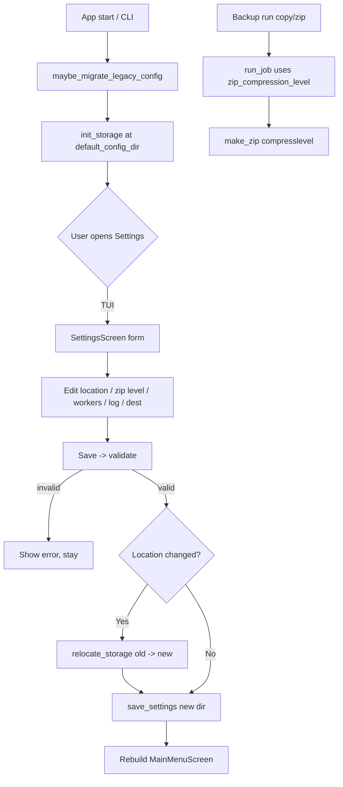

# ABackup — Settings Page & Storage Location

**Plan date:** 2026-07-12
**Status:** Draft for review
**Builds on:** [`2026-07-12-abackup-cli-plan.md`](2026-07-12-abackup-cli-plan.md), [`2026-07-12-abackup-run-all-batch-plan.md`](2026-07-12-abackup-run-all-batch-plan.md)
**Mode:** Architect (plan only — no implementation in this document)

---

## 1. Goals

1. **Settings page (TUI):** a new screen where the user can view and edit configuration.
2. **Default zip compression level:** a user-exposed setting (0–9) that controls `zipfile` compression; default `6`.
3. **Config/storage location:** the settings (and jobs) file is stored in the **user home directory** by default; on **Windows** it lives in the home `Documents` subfolder. The location itself is user-configurable from the settings page and is migrated atomically when changed.
4. **Decide the exposed setting surface** (see §3) and keep everything deterministic + atomic + fully tested.

---

## 2. Architecture Decisions (with rationale)

| Decision | Choice | Rationale | Fallback |
|---|---|---|---|
| Default storage location | `~/Documents/abackup` on Windows, `~/abackup` elsewhere | Explicit user requirement (home dir; Documents on Win) | `platformdirs.user_config_dir` (current behavior) |
| Compression level plumbing | New `zip_compression_level` on `Settings`; threaded `run_job` → `make_zip` → `ZipFile(compresslevel=...)` | Single source of truth; deterministic, testable | per-call constant |
| Location change = migration | `relocate_storage(old, new)` moves `settings.json` + `jobs.json` atomically, then updates `app.config_dir` | No lost jobs/settings; no corruption | copy-only (risk of divergence) |
| Exposed settings | location, zip level, max workers, log level, default destination | User-meaningful, low-risk, already partially modeled | expose everything (noise) |
| Legacy migration | One-time copy from old `platformdirs` path → new home path if new is empty | Preserves existing users' data on upgrade | start fresh (data loss) |
| Validation | `Settings.validate()` raises `ConfigError` for out-of-range values | Fail fast, deterministic | silent clamping |

---

## 3. Settings Exposed to the User

| Setting | Field | Type / Range | Default | Editable in UI | Notes |
|---|---|---|---|---|---|
| Storage location | `config_dir` (runtime, not stored in JSON) | directory path | home/Documents/abackup (Win) · home/abackup (else) | ✅ | Changing it triggers `relocate_storage` |
| Zip compression level | `zip_compression_level` | int 0–9 | `6` | ✅ | 0 = store, 9 = max |
| Max concurrent workers | `max_workers` | int ≥ 1 | `4` | ✅ | already exists |
| Log level | `log_level` | DEBUG/INFO/WARNING/ERROR | `INFO` | ✅ | already exists |
| Default destination | `default_destination` | str \| None | `None` | ✅ | prefill when adding jobs |
| **Internal (NOT exposed)** | `schema_version`, `first_run_completed`, `created_at` | — | — | ❌ | managed by code |

---

## 4. Default Storage Location (`src/abackup/core/paths.py`)

Replace the `platformdirs` default with an explicit, testable resolver:

```python
import sys
from pathlib import Path

def default_config_dir(platform: str | None = None, home: Path | None = None) -> Path:
    platform = platform or sys.platform
    home = home or Path.home()
    if platform == "win32":
        return home / "Documents" / "abackup"
    return home / "abackup"

def get_config_dir(override=None) -> Path:
    if override:
        return Path(override)
    return default_config_dir()
```

- `default_config_dir(platform, home)` takes injectable args so tests are deterministic without monkeypatching `sys`/`Path.home`.
- `get_config_dir` now falls back to `default_config_dir()` instead of `platformdirs`.

### 4.1 Legacy migration (`config.py`)

```python
LEGACY_DIR = Path(platformdirs.user_config_dir("abackup", "abackup"))

def maybe_migrate_legacy_config() -> None:
    """If the new home location has no settings but the old platformdirs
    location does, relocate it once (atomic move of both files)."""
```

Called from `init_storage` (app `on_mount`) and at the start of `cli.main` before loading.

---

## 5. Data Model Change (`src/abackup/models.py`)

Add to `Settings`:

```python
zip_compression_level: int = 6
```

Add a validation method (deterministic, raises `ConfigError`):

```python
def validate(self) -> None:
    if not (0 <= self.zip_compression_level <= 9):
        raise ConfigError("zip_compression_level must be 0-9")
    if self.max_workers < 1:
        raise ConfigError("max_workers must be >= 1")
    if self.log_level not in {"DEBUG", "INFO", "WARNING", "ERROR"}:
        raise ConfigError("invalid log_level")
```

`from_dict` already ignores unknown keys, so old `settings.json` stays compatible (new field defaults to `6`).

---

## 6. Compression Level Plumbing

### 6.1 `src/abackup/core/archive.py` — `make_zip`
Add `compress_level: int = 6`; pass to `zipfile.ZipFile(out, "w", zipfile.ZIP_DEFLATED, compresslevel=compress_level)` and to `writestr(info, data, compresslevel=compress_level)`.

### 6.2 `src/abackup/core/backup.py` — `run_job`
Add `zip_compression_level: int = 6` kwarg; pass to `make_zip(..., compress_level=zip_compression_level)`.

### 6.3 `src/abackup/core/runner.py` — `run_jobs_batch`
Add `zip_compression_level: int | None = None`. If `None`, load `Settings` from `config_dir` and use `settings.zip_compression_level`. Pass it to every `run_job` call. (Deterministic: injectable; `max_workers=1` keeps order stable.)

---

## 7. Storage Relocation (`src/abackup/config.py`)

```python
def relocate_storage(old_dir, new_dir) -> Path:
    """Atomically move settings.json + jobs.json from old_dir to new_dir.
    Creates new_dir, moves both files (os.replace), removes originals.
    Returns the new config dir."""
```

Reuses the existing `_atomic_write`/`os.replace` primitives; never leaves `.tmp` files.

---

## 8. TUI: Settings Screen (`src/abackup/tui/screens/settings.py`)

New `SettingsScreen`:
- Widgets: `Input#config_dir`, `Input#zip_level`, `Input#workers`, `Select#log_level`, `Input#default_dest`, `Static#error`, `Button#save`, `Button#cancel`.
- `on_mount`: prefill from `load_settings(self.config_dir)` and current `self.config_dir`.
- `on_button_pressed`:
  - `cancel` → return to `MainMenuScreen` (no changes).
  - `save` → parse + build `Settings` → `validate()`; on error show `#error` and stay. On success:
    - `old = self.config_dir`; `new = Path(parsed_config_dir).resolve()`
    - if `new != old`: `relocate_storage(old, new)`; `self.app.config_dir = new`; `self.config_dir = new`
    - `save_settings(settings, new)`
    - Rebuild main menu so no stale screen remains:
      `self.app.pop_screen()` (settings) → `self.app.pop_screen()` (stale main menu) → `self.app.push_screen(MainMenuScreen(new, self.data_dir))`

---

## 9. TUI: Main Menu Button (`src/abackup/tui/screens/main_menu.py`)

Add `Button("Settings", id="settings")` to the action row; handler pushes `SettingsScreen(self.config_dir, self.data_dir)`.

---

## 10. CLI (`src/abackup/cli.py`)

Add `--show-settings` flag: prints the resolved `config_dir` and the current `Settings` (incl. `zip_compression_level`) as JSON to stdout, then returns (no TUI). Useful for scripting and for verifying the storage location.

```python
parser.add_argument("--show-settings", action="store_true",
                    help="Print resolved config dir + current settings and exit")
```

In `main`: if `args.show_settings`: `print(json.dumps({"config_dir": str(get_config_dir(args.config_dir)), **load_settings(args.config_dir).to_dict()}, indent=2))`; `return`.

---

## 11. Workflow (Mermaid)



---

## 12. Detailed Atomic Steps (each with tests)

> **Determinism rules:** inject `platform`/`home` into `default_config_dir`; inject `clock`/`max_workers`/`zip_compression_level` into runners; relocation uses `os.replace` (atomic); tests use `tmp_config`/`tmp_data` fixtures and `monkeypatch` for paths.

### Step 1 — Default config dir + legacy migration (`paths.py`, `config.py`)
- Implement `default_config_dir(platform, home)`; repoint `get_config_dir`; add `maybe_migrate_legacy_config` + `relocate_storage`.
- **Tests:** `test_default_config_dir_windows` (platform=win32, home=/x → /x/Documents/abackup); `test_default_config_dir_posix` (→ /x/abackup); `test_get_config_dir_override_wins`; `test_legacy_migration_moves_files` (seed legacy dir, run migration, assert new dir has settings+jobs, legacy empty/removed); `test_relocate_storage_atomic_no_tmp` (assert no `.tmp` leftovers, both files present in new dir, absent in old).

### Step 2 — `zip_compression_level` on `Settings` (`models.py`)
- Add field + `validate()`.
- **Tests:** `test_zip_level_default_6`; `test_settings_validate_rejects_level_10`; `test_settings_validate_rejects_level_neg`; `test_settings_validate_rejects_bad_log_level`; `test_settings_from_dict_defaults_level`; round-trip keeps value.

### Step 3 — Compression level into zip (`archive.py`, `backup.py`, `runner.py`)
- Thread `compress_level` through `make_zip` → `run_job` → `run_jobs_batch` (loads from settings when `None`).
- **Tests:** `test_make_zip_level_store_smaller_than_max` (level 0 archive larger than level 9 for compressible data — assert sizes differ and level 9 ≤ level 0); `test_run_job_uses_compression_level` (spy/monkeypatch `make_zip` asserts `compress_level` passed); `test_run_jobs_batch_passes_level_from_settings` (set level in settings, monkeypatch `run_job` to capture kwarg).

### Step 4 — `relocate_storage` correctness (`config.py`)
- Move both files; keep JSON valid; no corruption.
- **Tests:** `test_relocate_moves_settings_and_jobs`; `test_relocate_idempotent_when_same_dir` (no-op, no error); `test_relocate_creates_new_dir`.

### Step 5 — TUI Settings screen (`tui/screens/settings.py`)
- Form + save/cancel + validation + relocation + main-menu rebuild.
- **Tests (pilot):** `test_settings_button_opens_screen` (main menu → SettingsScreen); `test_settings_change_compression_level` (set `#zip_level=9`, save, reload settings.json → level 9); `test_settings_validation_error_stays` (set `#zip_level=99`, save, still on SettingsScreen, `#error` shown, file unchanged); `test_settings_relocate_on_save` (set `#config_dir` to new tmp dir, save, assert settings.json+jobs.json in new dir, old dir cleared, `app.config_dir` updated); `test_settings_cancel_no_change` (cancel → back to main menu, settings.json untouched).

### Step 6 — Main menu Settings button (`main_menu.py`)
- New button + handler.
- **Tests (pilot):** `test_main_menu_settings_button` → screen becomes `SettingsScreen`.

### Step 7 — CLI `--show-settings` (`cli.py`)
- Print resolved config dir + settings.
- **Tests:** `test_cli_show_settings` (capture stdout; contains `config_dir` and `zip_compression_level`; exit 0); `test_cli_show_settings_reflects_default_location` (stdout `config_dir` ends with `abackup` under home).

### Step 8 — README + consistency (`README.md`, `test_readme.py`)
- Document the Settings page, zip compression level, storage location (home / Documents on Windows), and `--show-settings`.
- **Tests:** README mentions `Settings`, `compression level`, `Documents` (Windows), `home`, `--show-settings`; `Settings.zip_compression_level` referenced.

### Step 9 — Coverage gate
- Re-run `pytest --cov=src/abackup --cov-fail-under=90`; keep ≥90%.

---

## 13. Testing Strategy

- **Unit (paths):** inject `platform`/`home`; assert exact default paths per OS.
- **Unit (models):** validate ranges; round-trip; backward-compatible load.
- **Unit (archive):** compare archive sizes for level 0 vs 9 on compressible input; assert determinism (same bytes for same inputs).
- **Unit (config):** relocation atomicity, no `.tmp` leftovers, idempotency, legacy migration.
- **TUI (pilot):** open settings, edit + save (incl. relocation), validation error, cancel.
- **CLI:** capture stdout for `--show-settings`; assert location + fields.

---

## 14. Acceptance Criteria

1. A **Settings** page exists in the TUI, reachable from the main menu.
2. User can set **zip compression level (0–9)**; it is applied to every zip backup and persisted.
3. By default the settings/jobs file is stored in the **user home**; on **Windows** it is in **home/Documents/abackup**. The location is user-editable and changes are migrated atomically (no lost jobs/settings, no `.tmp` leftovers).
4. Existing installs are migrated from the old `platformdirs` location on first run (no data loss).
5. Invalid settings (e.g. level 10, workers 0) are rejected with a clear error and not saved.
6. `abackup --show-settings` prints the resolved storage location and current settings.
7. All 9 steps have passing tests; coverage stays ≥90%.

---

## 15. Open Decisions (documented, not blocking)

- **Non-Windows default = `~/abackup`** (visible, matches "home dir" instruction); switch to `~/.config/abackup` if convention is preferred later.
- **Relocation moves both `settings.json` and `jobs.json`** together so a job set is never split across locations.
- **Validation fails closed** (`ConfigError`) rather than silently clamping, for deterministic, predictable behavior.
